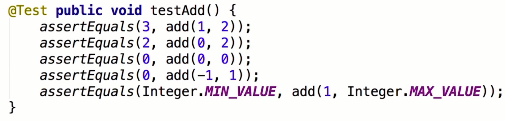
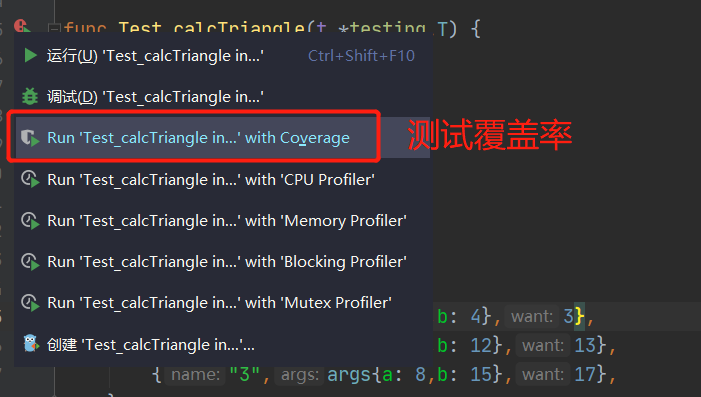
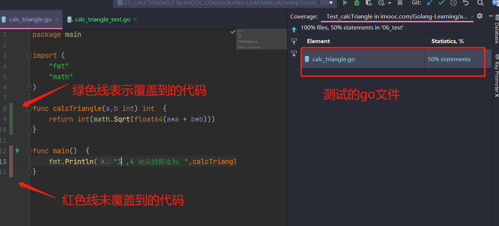
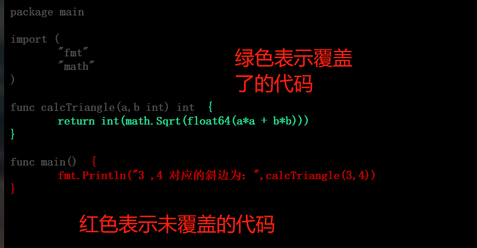

# 传统测试

- 测试数据和测试逻辑混在一起
- 出错信息不明确
- 一旦一个数据出错，则测试全部结束；改了其中一个，测试发现又挂了，再改，再挂，直到全部改好

Java 单元测试案列：



# 表格驱动测试

- 分离的测试数据和测试逻辑
- 明确的出错信息
- 可以部分失败
- go 语言的语法使得我们更易实践表格驱动测试

# Go 中的测试

为表格驱动测试，测试的 go 文件必须以 `_test`为后缀

## 一、功能测试

**测试内容：三角形三边关系**

定义以下 go 文件，`calc_triangle.go`

```go
func calcTriangle(a,b int) int  {
	return int(math.Sqrt(float64(a*a + b*b)))
}

```

**测试文件** `calc_triangle_test.go`：

```go
package main

import "testing"

func Test_calcTriangle(t *testing.T) {
    // 1.测试数据
	type args struct {
		a int
		b int
    }
    // 像表格一样，定义好测试用例
	tests := []struct {
		name string
		args args
		want int
	}{
        // 填写测试用例数据，故意将斜边输错
        {"1",args{a: 3,b: 4},3},
        // 上一个测试用例出错不会影响之后的测试
		{"2",args{a: 5,b: 12},13},
		{"3",args{a: 8,b: 15},17},
    }

    // 2.测试逻辑
	for _, tt := range tests {
		t.Run(tt.name, func(t *testing.T) {
			if got := calcTriangle(tt.args.a, tt.args.b); got != tt.want {
                // 自定义日志内容
				t.Errorf("calcTriangle() = %v, want %v", got, tt.want)
			}
		})
	}
}
```

执行测试:

- IDE 方式，Goland 下，按运行按钮
- 命令行方式，先 cd 到测试文件的目录，然后执行：`go test .`

**测试结果：**

```sh
=== RUN   Test_calcTriangle
=== RUN   Test_calcTriangle/1
    Test_calcTriangle/1: calc_triangle_test.go:22: calcTriangle() = 5, want 3
=== RUN   Test_calcTriangle/2
=== RUN   Test_calcTriangle/3
--- FAIL: Test_calcTriangle (0.00s)
    --- FAIL: Test_calcTriangle/1 (0.00s)
    --- PASS: Test_calcTriangle/2 (0.00s)
    --- PASS: Test_calcTriangle/3 (0.00s)
FAIL
```

`=== RUN Test_calcTriangle/1`的测试用例出错了，其会清晰的打印错误所处的位置和日志信息

后半部分的内容：

- `PASS`表示测试成功
- `FAIL`表示测试失败
- `--- FAIL: Test_calcTriangle (0.00s)`...之后的内容会清晰的列出每个测试用例的情况
- 最后一个结果，表示总测试结果，只要有一个测试用例出错，则表示此次测试失败。

**总结：**

- 测试数据和测试逻辑是分开的，不会混合在一起
- 上一个测试用例出错不会影响之后的测试
- 错误日志清晰可靠，定位明确

## 二、代码覆盖率

执行测试:

### 1. IDE 方式，Goland 下，按运行按钮，选择代码覆盖率方式测试



结果：

```sh
=== RUN   Test_calcTriangle
=== RUN   Test_calcTriangle/1
    Test_calcTriangle/1: calc_triangle_test.go:22: calcTriangle() = 5, want 3
=== RUN   Test_calcTriangle/2
=== RUN   Test_calcTriangle/3
--- FAIL: Test_calcTriangle (0.00s)
    --- FAIL: Test_calcTriangle/1 (0.00s)
    --- PASS: Test_calcTriangle/2 (0.00s)
    --- PASS: Test_calcTriangle/3 (0.00s)
FAIL
coverage: 50.0% of statements in ../../../Golang-Learning/...
```

观察发现，在最后多了一行 `coverage: 50.0% of statements in ../../../Golang-Learning/...`，50.0% 表示代码覆盖率

打开对应的代码文件，可以看到， IDE 智能提示出代码的覆盖情况：



### 2. 命令行方式

先 cd 到测试文件的目录，然后执行：`go test -coverprofile=test.out`

该命令执行后，会在当前目录(也就是测试文件目录)下生成一个 `test.out` 文件，可以查看其内容。

因为直接查看并不直观，看不太懂，所以可以使用 `go tool` 命令辅助我们查看该文件

`go tool cover -html=test.out`

执行该命令会在浏览器中弹出一个页面，大致如下：



## 三、性能测试

性能测试(或者说基准测试)的前缀是 `Benchmark`，参数为：`*testing.B`

**值得注意的是：**
在进行基准测试时，测试用例的迭代次数`b.N`是由 Go 自行决定的，虽然用户可以通过限制基准测试的运行时间达到限制迭
代次数的目的，但用户是无法直接指定迭代次数的——测试程序将进行足够多次的迭代，直到获得一个准确的测量值为止。

在 Go 1.5 之后，test 子命令拥有一个 `-test.count` 标志，它可以让用户指定每个测试以及基准测试的运行次数，该标志的默认值为 1。

**性能测试代码：**

```go
func BenchmarkCalcTriangle(b *testing.B)  {
	numA,numB,want := 3,4,5
	for i:=0;i<b.N;i++{
		if got := CalcTriangle(numA, numB); got != want {
			b.Errorf("calcTriangle() = %v, want %v", got,want)
		}
	}
}
```

### 1.IDE 方式

直接点击对应性能测试函数的运行按钮

**结果：**

```sh
goos: windows
goarch: amd64
pkg: imooc.com/Golang-Learning/advanced/06_test
BenchmarkCalcTriangle
BenchmarkCalcTriangle-8         1000000000               0.682 ns/op
PASS

```

可以看到:

- goos：windows，操作系统类型
- goarch：amd64，一种 64 位元的电脑处理器架构
- pkg：代码所处目录
- BenchmarkCalcTriangle-8...：表示运行了 1000000000 次，每次 for 代码快的内容执行耗时：0.682 ns

### 2.命令行方式

先 cd 到测试文件的目录，然后执行：`go test -bench .`。

执行发现执行了功能测试的代码，并未执行性能测试的代码。

为了只执行功能测试的代码，可以通过运行标志 `-run` 来忽略功能测试。`-run`标志用于指定需要被执行的功能测试用例，如果用户把一个能测试名字不存在的功用作`-run` 标志的参数，那么所有功能测试都将被忽略。比如，如果我们执行以下命令：

`go test -run x -bench .`

那么由于我们的测试中不存在任何名字为 x 的功能测试用例，因此所有功能测试都不会被运行。在只执行基准测试的情况下，`go test`命令将产生以下结果：

```sh
goos: windows
goarch: amd64
pkg: imooc.com/Golang-Learning/advanced/06_test
BenchmarkCalcTriangle-8         1000000000               0.659 ns/op
PASS
ok      imooc.com/Golang-Learning/advanced/06_test      1.042s

```
