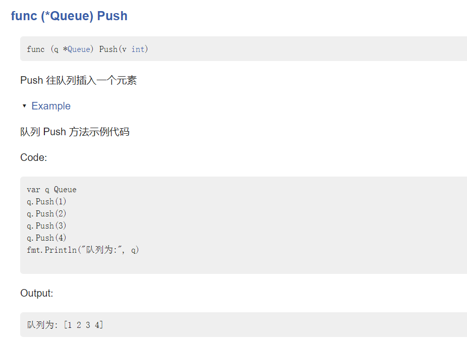

# godoc 命令生成库文档和示例文档

godoc 命令可以将当前代码生成一个系统性的文档，用户写好注释和示例代码，`godoc`命令都会自动生成对应的文档，类似 Golang 官网库的效果

## 一.godoc 生成代码文档

### 1.编写自己的代码

实现一个队列结构，并加上注释

**注意：**该代码块不要写在 `main` 包下，否则不会识别出。因为 godoc 命令是识别库代码，不是命令代码(即 main 文件)

代码如下：

```go
package queue

// 定义一个数据类型为int的队列
type Queue []int

// Push 往队列插入一个元素
func (q *Queue) Push(v int) {
	*q = append(*q, v)
}

// Pop 从队列里移除第一个元素
func (q *Queue) Pop() int {
	head := (*q)[0]
	*q = (*q)[1:]
	return head
}

// IsEmpty 判断队列是否为空
func (q *Queue) IsEmpty() bool {
	return len(*q) == 0
}
```

### 2.godoc 命令生成文档

在终端中执行命令：`godoc -http :8080`，表示新建一个页面，端口为 8080。

在浏览器中输出 `localhost:8080`，展示出来的文档包含以下内容：

- go 代码库的文档
- 引用第三方库的文档
- 自己编写的代码

找到自己的代码库，并打开，如下图：


**如果运行 godoc 命令提示不是内部或外部命令，也不是可运行的程序 或批处理文件，自行安装即可，不过记得将生成命令文件移到 GOROOT 环境变量的 bin 目录中**

如，我的 `GOROOT` 为：E:\Language\Golang
将生成的 godoc 可执行文件 放到：E:\Language\Golang\bin 中。

## 二.生成示例文档

通常我们查看 go 库文档时，除了相关定义之外还有会代码示例。

在 go 中，方法名要以`Example**`作为前缀(表示示例代码)，并且 代码段中加入 `// Output` 来生成类似的代码示例文档。

该 `Example**`方法实现在 `_test`文件，可以直接运行。

先生成一个 `queue_test.go`文件，填入以下代码：

```go
package queue

import "fmt"

// 队列 Push 方法示例代码
func ExampleQueue_Push() {
	var q Queue
	q.Push(1)
	q.Push(2)
	q.Push(3)
	q.Push(4)
	fmt.Println("队列为:", q)

	// Output:
	// 队列为: [1 2 3 4]
}

// 队列 Pop 方法示例代码
func ExampleQueue_Pop() {
	// 测试队列
	var q Queue
	q.Push(1)
	q.Push(2)
	fmt.Println("队列为:", q)

	q.Pop() // 移除第一个元素
	fmt.Println("移除元素后，队列为:", q)

	// Output:
	// 队列为: [1 2]
	// 移除元素后，队列为: [2]
}
func ExampleQueue_IsEmpty() {
	// 测试队列
	var q Queue
	q.Push(1)
	q.Push(2)
	fmt.Println("队列为:", q)

	fmt.Println("队列是否为空：", q.IsEmpty())
	q.Pop()
	q.Pop()
	fmt.Println("移除元素后，队列是否为空:", q.IsEmpty())

	// Output:
	// 队列为: [1 2]
	// 队列是否为空： false
	// 移除元素后，队列是否为空: true
}
```

键入 `Example` IDE 就会智能提示要生成的方法示例。

**注意：**

- 方法名必须以 `Example` 开头，并且后面命名按照智能提示来，乱写会生成不了对应的文档
- 文档中方法列表是倒序排列的，和用户编写的方法顺序相反
- 在最后加入 `// Output`，并补全输出结果，这样在示例文档中能看到输出结果

如图：


点 Push 方法进去看一下具体示例代码：


