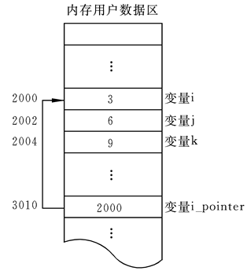

# 一、语⾔发展历程
## 1.1 机器语⾔
计算机的⼤脑或者说⼼脏就是CPU，它控制着整个计算机的运作。每种CPU，都有⾃⼰的指令系
统。这个指令系统，就是该CPU的机器语⾔。

机器语⾔是⼀组由0和1系列组成的指令码，这些指令码，是CPU制作⼚商规定出来的，然后发布
出来，请程序员遵守。

要让计算机⼲活，就得⽤机器语⾔(⼆级制数)去命令它。这样的命令，不是⼀条两条，⽽是上百
条。⽽且不同型号的计算机其机器语⾔是不相通的，按着⼀种计算机的机器指令编制的程序，不
能在另⼀种计算机上执⾏。
## 1.2 汇编语⾔和编译器
机器语⾔编程是不是很令⼈烦恼呢，终于出现了汇编语⾔，就是⼀些标识符取代0与1。⼀⻔⼈类
可以⽐较轻松认识的编程语⾔。

只是这⻔语⾔计算机并不认识，所以⼈类还不能⽤这⻔语⾔命令计算机做事情。这正如如何才能
让中国⼈说的话美国⼈明⽩呢？——翻译！

所以，有⼀类专⻔的程序，既认识机器语⾔，⼜认识汇编语⾔，也就是编译器，将标识符换成0与 1，知道怎么把汇编语⾔翻译成机器语⾔。
## 1.3 ⾼级语⾔
汇编语⾔和机器语⾔都是⾯向机器的，机器不同，语⾔也不同。既然有办法让汇编语⾔翻译成机
器语⾔，难道就不能把其他更⼈性化的语⾔翻译成机器语⾔？

1954年，Fortran语⾔出现了，其后相继出现了其他的类似语⾔。这批语⾔，使程序员摆脱了计算
机硬件的限制，把主要精⼒放在了程序设计上，不在关注低层的计算机硬件。这类语⾔，称为⾼
级语⾔。

同样的，⾼级语⾔要被计算机执⾏，也需要⼀个翻译程序将其翻译成机器语⾔，这就是编译程
序，简称编译器。

这类⾼级语⾔解决问题的⽅法是分析出解决问题所需要的步骤，把程序看作是数据被加⼯的过
程。基于这类⽅法的程序设计语⾔成为⾯向过程的语⾔。C语⾔就是这种⾯向过程的程序设计语
⾔。

# 二、编译过程
## 2.1 编译步骤
**编译步骤**
- 词法分析阶段：读⼊源程序，对构成源程序的字符流进⾏扫描和分解，识别出单词。

- **语法**分析阶段：机器通过词法分析，将单词序列分解成不同的语法短语，确定整个输⼊串能
够构成语法上正确的程序。

- **语义**分析阶段：检查源程序上有没有语义错误，在代码⽣成阶段收集类型信息

- 中间代码⽣成阶段：在进⾏了上述的语法分析和语义分析阶段的⼯作之后,有的编译程序将源
程序变成⼀种内部表示形式

- 代码优化：这⼀阶段的任务是对前⼀阶段产⽣的中间代码进⾏变换或进⾏改造,⽬的是使⽣成
的⽬标代码更为⾼效,即省时间和省空间

- ⽬标代码⽣成：这⼀阶段的任务是把中间代码变换成特定机器上的绝对指令代码或可重定位
的指令代码或汇编指令代码

## 2.2 编译器
使⽤编辑器编写程序，由编译器编译后才可以运⾏，编译器是将易于编写、阅读和维护的⾼级计
算机语⾔翻译为计算机能解读、运⾏的低级机器语⾔的程序。

编译器就是将 “⼀种语⾔（通常为⾼级语⾔）” 翻译为 “另⼀种语⾔（通常为低级语⾔）” 的程序。
⼀个现代编译器的主要⼯作流程：

**源代码(source code)** → **预处理器(preprocessor)** → **编译器 (compiler)** → **⽬标代码(object code)**
→ **链接器(Linker)** → **可执⾏程序(executables)**

### 2.2.1 GCC编译器介绍

GCC（GNU Compiler Collection，GNU 编译器套件），是由 GNU 开发的编程语⾔编译器。GCC
原本作为GNU操作系统的官⽅编译器，现已被⼤多数类Unix操作系统（如Linux、BSD、Mac OS
X等）采纳为标准的编译器，GCC同样适⽤于微软的Windows。

GCC最初⽤于编译C语⾔，随着项⽬的发展gcc已经成为了能够编译C、C++、Java、Ada、
fortran、Object C、Object C++、Go语⾔的编译器⼤家族。

### 2.2.2 GCC编译流程
编译命令格式：
```shell
gcc [-option1] ...
g++ [-option1] ...
```
- 命令、选项和源⽂件之间使⽤空格分隔
- ⼀⾏命令中可以有零个、⼀个或多个选项
- ⽂件名可以包含⽂件的绝对路径，也可以使⽤相对路径

如果命令中不包含输出可执⾏⽂件的⽂件名，可执⾏⽂件的⽂件名会⾃动⽣成⼀个默认名，Linux平台为a.out，Windows平台为a.exe

GCC、g++编译常⽤选项说明：

- -o  file 指定⽣成的输出⽂件名为file
- -E  只进⾏预处理
- -S  只进⾏预处理和编译
- -c  只进⾏预处理、编译和汇编


### 2.2.3 注意事项
Linux编译后的可执⾏程序只能在Linux运⾏，Windows编译后的程序只能在Windows下运⾏。

64位的Linux编译后的程序只能在64位Linux下运⾏，32位Linux编译后的程序只能在32位的Linux
运⾏。

64位的Windows编译后的程序只能在64位Windows下运⾏，32位Windows编译后的程序可以在

64位的Windows运⾏

## 2.3 编译过程
**程序编译步骤:**
代码编译成可执⾏程序经过4步：

- 预处理：宏定义展开、头⽂件展开、条件编译等，同时将代码中的注释删除，这⾥并不会检查语法
- 编译：检查语法，将预处理后⽂件编译⽣成汇编⽂件
- 汇编：将汇编⽂件⽣成⽬标⽂件(⼆进制⽂件)
- 链接：程序是需要依赖各种库的，所以编译之后还需要把库链接到最终的可执⾏程序中去，比如在Windows系统下，会连接dll(动态连接库)。


**将高级语言编译成机器可以执行的语言的过程**

go语言编译方式：
```go
go build 源代码.go
```
```go
go run 源代码.go
```


```shell
// 交叉编译
CGO_ENABLED=0 GOOS=linux GOARCH=amd64 go build main.go
```
+ CGO_ENABLED 是否使用cgo编译，0为不使用，1为使用
+ GOOS 指定编译的操作系统
+ GOARCH 指定操作系统的位数

## 2.4 CGO混合编程
**使用场景：**在编程时有C语言已经实现好的库

通过 `/**/`包裹C代码， 可以在GO语言中调用C代码 实现对应的库的调用
```go
package main

/*
//C语言函数
#include <stdio.hvoid SayHello()
{
	printf("hello world\n");
}
 */
import "C"

func main() {
	//调用c语言代码
	C.SayHello()
}
```

**注意：** `import "C"`必须紧跟在C代码后才能编译成功

#  三、指针和内存

## 3.1 内存
**内存含义：**

- 存储器：计算机的组成中，⽤来存储程序和数据，辅助CPU进⾏运算处理的重要部分。
- 内存：内部存贮器，暂存程序/数据——掉电丢失 SRAM、DRAM、DDR、DDR2、DDR3。
- 外存：外部存储器，⻓时间保存程序/数据—掉电不丢ROM、ERRROM、FLASH（NAND、NOR）、硬盘、光盘。

**内存是沟通CPU与硬盘的桥梁：**
- 暂存放CPU中的运算数据
- 暂存与硬盘等外部存储器交换的数据

## 3.2 物理存储器和存储地址空间
有关内存的两个概念：**物理存储器和存储地址空间**。

**物理存储器**：实际存在的具体存储器芯⽚。

- 主板上装插的内存条
- 显示卡上的显示RAM芯⽚
- 各种适配卡上的RAM芯⽚和ROM芯⽚  
- 
**存储地址空间**：对存储器编码的范围。我们在软件上常说的内存是指这⼀层含义。
- 编码：对每个物理存储单元（⼀个字节）分配⼀个号码
- 寻址：可以根据分配的号码找到相应的存储单元，完成数据的读写
## 3.3 内存地址
将内存抽象成⼀个很⼤的**⼀维字符数组**。

编码就是对内存的每⼀个字节分配⼀个32位或64位的编号（与32位或者64位处理器相关）。

这个**内存编号**我们称之为**内存地址**。

内存中的每⼀个数据都会分配相应的地址：
- char:占⼀个字节分配⼀个地址
- int: 占四个字节分配四个地址
- float、struct、函数、数组等

## 3.4 指针
只要将**数据存储在内存中都会为其分配内存地址**。

内存地址使⽤**⼗六进数据**表示。

内存为**每⼀个字节分配⼀个32位或64位的编号**（与32位或者64位处理器相关）。

- 内存区的每⼀个字节都有⼀个编号，这就是“地址”。
- 如果在程序中定义了⼀个变量，在对程序进⾏编译或运⾏时，系统就会给这个变量分配内存单元，并确定它的内存地址(编号)
- 指针的实质就是内存“地址”。指针就是地址，地址就是指针。
- 指针是内存单元的编号，指针变量是存放地址的变量。
- 通常叙述时会把指针变量简称为指针，实际他们含义并不⼀样。

如图：



### 3.4.1 指针变量的定义和使⽤
- 指针也是⼀种数据类型，指针变量也是⼀种变量
- 指针变量指向谁，就把谁的地址赋值给指针变量
- `*`操作符操作的是指针变量指向的内存空间
- `&`操作符是取地址符

可以通过指针变量来存储，所谓的指针变量：就是⽤来**存储任何⼀个值的内存地址**。

**定义：**
```go
//定义指针变量
var 指针变量名 //默认初始值为nil 指向内存地址编号为0的空间
var 指针变量名 *数据类型 = &变量
```
**实例：**
```go
func main() {
    var i int = 10
    //指针类型变量
    //指针变量也是变量 指针变量指向了变量的内存地址
    //对变量取地址 将结果赋值给指针变量
    var p *int = &i
    //打印指针变量p的值 同时也是i的地址
    fmt.Println(p)
 }
```

### 3.4.2 通过指针间接修改变量的值
```go
var a int = 10
//var p *int = &a
//通过⾃动推导类型创建指针变量
p := &a
//通过指针间接修改变量的值
*p = 123
fmt.Println(a)

```